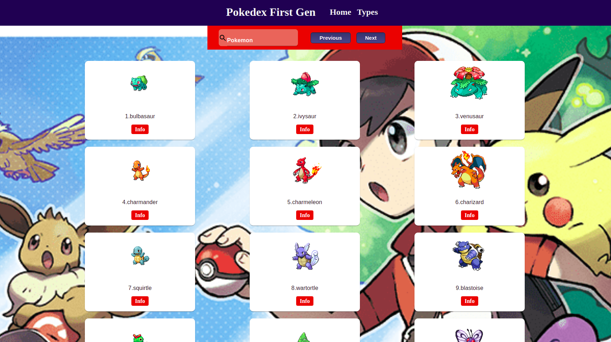
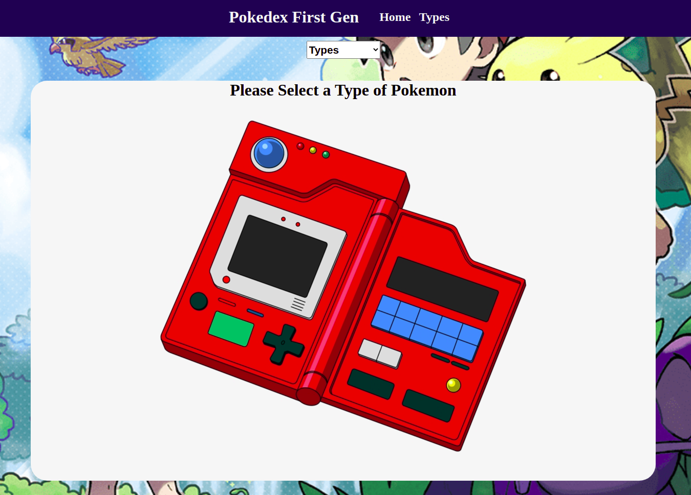

## React Capstone: Pokemon Catagolgue

## Table of Contents

* [About the Project](#about-the-project)
    * [Built With](#built-with)
* [Getting Started](#getting-started)
    * [Prerequisites](#prerequisites)
    * [Installation](#installation)
* [Contributing](#contributing)
* [License](#license)
* [Author](#author)
* [Show Your support](#show-your-support)
* [Acknowledgements](#acknowledgements)

## Screenshots



<br>



<br>

## 🔴 Live Demo

[Live Demo](https://pure-chamber-86282.herokuapp.com/)

<br>

<!-- ABOUT THE PROJECT -->
## :scroll: About The Project

Pokedex First Gen it's a catalogue of pokemons where you can find all the pokemons and filter by name or fitler by type.
This catalogue it's maded whit the requirments of "CATALOGUE OF DOG CLOTHES" from MICROVERSE CAPSTONE.

### 🛠 Built With

* Node.js
* React
* React-DOM
* React-Create-App
* npm
* CSS
* ES6


<!-- GETTING STARTED -->
## 🔧 Getting Started

To get a local copy up and running follow these simple example steps.

### 📝 Prerequisites

This is an example of how to list things you need to use the software and how to install them.
* npm
```sh
npm install npm@latest -g
```

### 📝 Installation

1. Clone the repo
```sh
git clone git@github.com:diazgio/React-Capstone-Catalogue.git
```
2. Install NPM packages
```sh
npm install
```

3. Run:
```
npm start
```

Runs the app in the development mode.\
Open [http://localhost:3000](http://localhost:3000) to view it in the browser.

The page will reload if you make edits.\
You will also see any lint errors in the console.

4. Run 
```
npm test
```

Launches the test runner in the interactive watch mode.\
See the section about [running tests](https://facebook.github.io/create-react-app/docs/running-tests) for more information.

5. Run 
```
npm run build
```

Builds the app for production to the `build` folder.\
It correctly bundles React in production mode and optimizes the build for the best performance.

The build is minified and the filenames include the hashes.\
Your app is ready to be deployed!

See the section about [deployment](https://facebook.github.io/create-react-app/docs/deployment) for more information.


<!-- CONTRIBUTING -->
## 🤝 Contributing

Contributions are what make the open source community such an amazing place to be learn, inspire, and create. Any contributions you make are **greatly appreciated**.

1. Fork the Project
2. Create your Feature Branch (`git checkout -b feature/AmazingFeature`)
3. Commit your Changes (`git commit -m 'Add some AmazingFeature'`)
4. Push to the Branch (`git push origin feature/AmazingFeature`)
5. Open a Pull Request


<!-- LICENSE -->
## 📝 License

Distributed under the MIT License. See `LICENSE` for more information.


<!-- CONTACT -->
## 👤 Author

👤 **Giordano Díaz**

- Github: [@diazgio](https://github.com/diazgio)
- Twitter: [@giordano_diaz](https://twitter.com/giordano_diaz)
- LinkenIn:[giordano-diaz](www.linkedin.com/in/Giordano-Diaz)

<br>

## :pray: Show your support

Give a ⭐️ if you like this project!


<!-- ACKNOWLEDGEMENTS -->

## :point_right: Acknowledgments

- Microverse
- GitHub
- The-Thanatos Team